# 绘制效果(Cover)

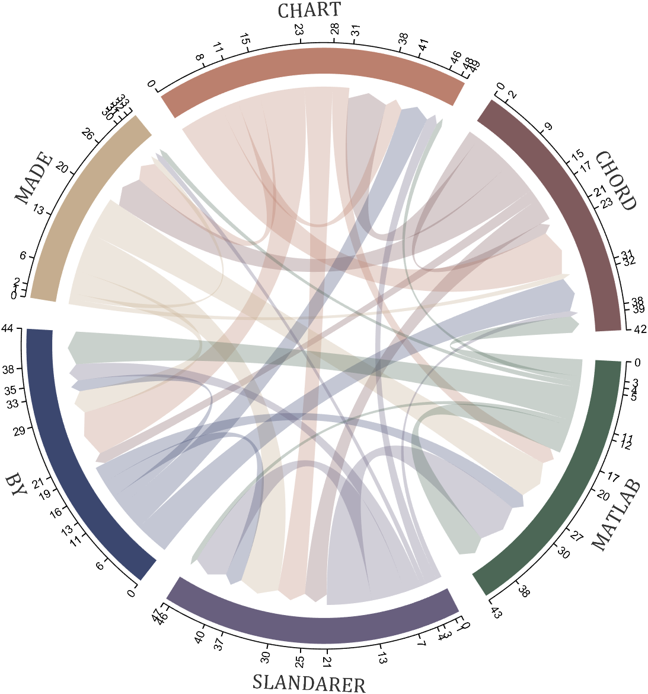

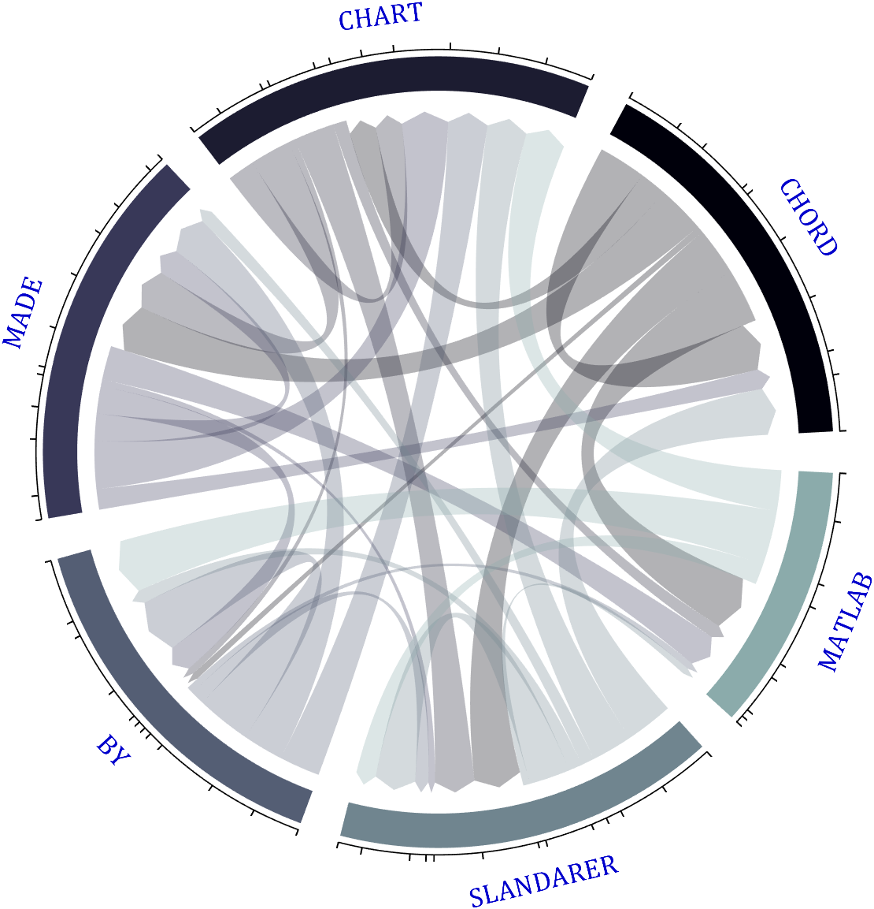


___
# 详细教程(User Guide)
## 0 数据准备(Data preparation)
数据应准备全是非负数值的方形矩阵，矩阵第 i 行第 j 列表示由节点 i 流向节点 j ，第 j 行第 i 列表示由节点 j 流向节点 i，也就是说矩阵是非对称的，可以同时统计两个节点互相的数据流动,这里构造个随机数矩阵：\
The data should be prepared as a square matrix consisting entirely of non-negative values. The element at the *i*-th row and *j*-th column of the matrix represents the flow from node i to node j, while the element at the j-th row and i-th column represents the flow from node j to node i. In other words, the matrix is ​​asymmetric, allowing for the simultaneous tracking of data flows in both directions between any two nodes. Here, we construct a random matrix for this purpose:
```matlab
dataMat = randi([0, 8], [6, 6]);
```
## 1 基础绘图(Basic usage)
```matlab
dataMat = randi([0, 8], [6, 6]);

BCC = biChordChart(dataMat);
BCC = BCC.draw(); 
```
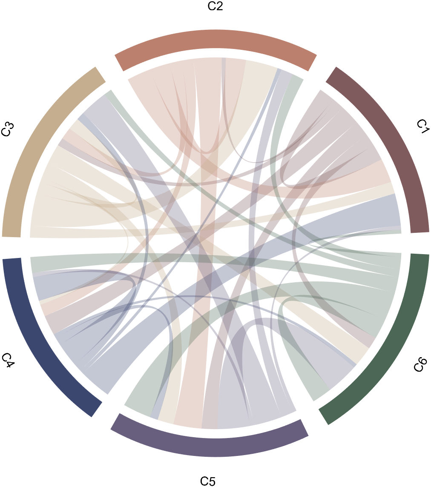

## 2 方向箭头(Directional arrow)
两侧都是弧形仅仅靠颜色不容易区分流入还是流出，因此可在创建对象时将`Arrow`属性设置为`'on'`：\
Since both ends are curved, it is difficult to distinguish between inflow and outflow based solely on color; therefore, you can set the `Arrow` property to `'on'` when creating the object:
```matlab
dataMat = randi([0, 8], [6, 6]);

BCC = biChordChart(dataMat, 'Arrow','on');
BCC = BCC.draw(); 
```
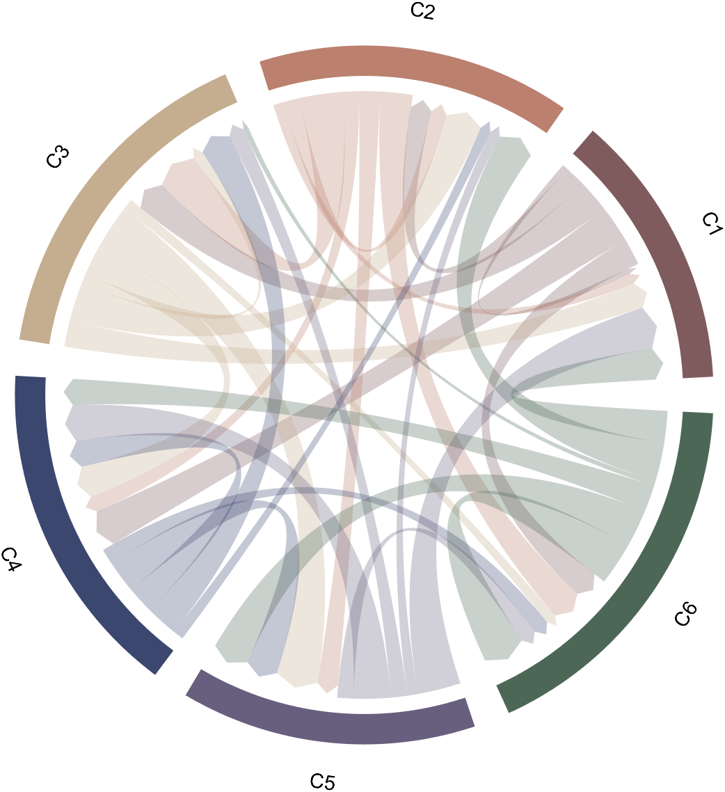

## 3 绘图间隙(Sep)

通过`Sep`属性可调整绘图间隙，例如设置为特别小的1/120：\
The plotting gap can be adjusted using the `Sep` attribute—for example, by setting it to a particularly small value of 1/120:
```matlab
dataMat = randi([0, 8],[ 6, 6]);

BCC = biChordChart(dataMat, 'Arrow','on', 'Sep',1/120);
BCC = BCC.draw(); 
```
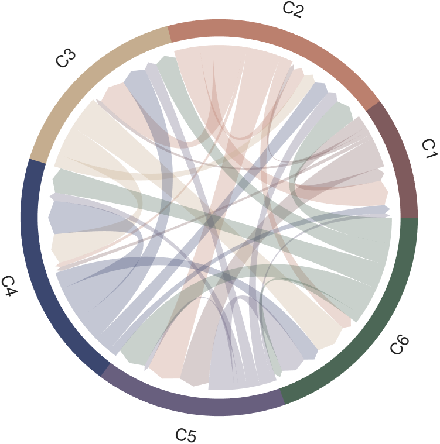

## 4 添加刻度(Show ticks)
通过`tickState`函数设置显示或者隐藏刻度：\
Use the `tickState` function to show or hide ticks:
```matlab
dataMat = randi([0, 8], [6, 6]);

BCC = biChordChart(dataMat, 'Arrow','on');
BCC = BCC.draw(); 

% 添加刻度(Show ticks)
BCC.tickState('on')
```
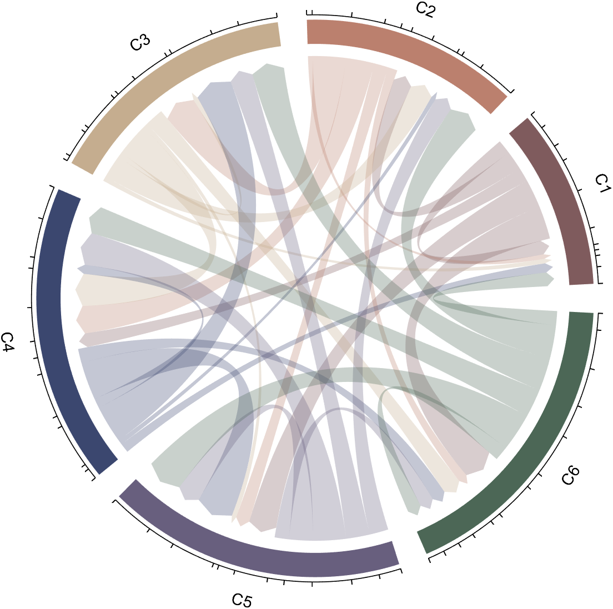

## 5 修改标签(Change name labels)
标签名字默认为`C1,C2,C3,...`可以通过`Label`属性进行修改例如：\
The default label names are `C1, C2, C3, ...`; these can be modified using the `Label` property. For example:
```matlab
dataMat = randi([0, 8], [6, 6]);

% 添加标签名称(Change name labels)
NameList = {'CHORD','CHART','MADE','BY','SLANDARER','MATLAB'};
BCC = biChordChart(dataMat, 'Label',NameList, 'Arrow','on');
BCC = BCC.draw();
```
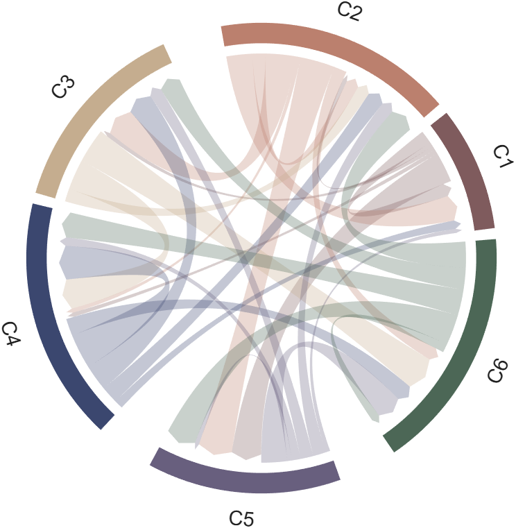

## 6 旋转标签(Rotate labels)
```matlab
dataMat = randi([0, 8], [6, 6]);

% 添加标签名称(Change name labels)
NameList = {'CHORD','CHART','MADE','BY','SLANDARER','MATLAB'};
BCC = biChordChart(dataMat,'Label',NameList,'Arrow','on');
BCC = BCC.draw(); 

% 添加刻度(Show ticks)
BCC.tickState('on')

% 修改字体，字号及颜色(Set Font for labels)
BCC.setFont('FontName','Cambria', 'FontSize',17, 'Color',[.2,.2,.2])

BCC.labelRotate('on')
% BCC.labelRotate('none')
```
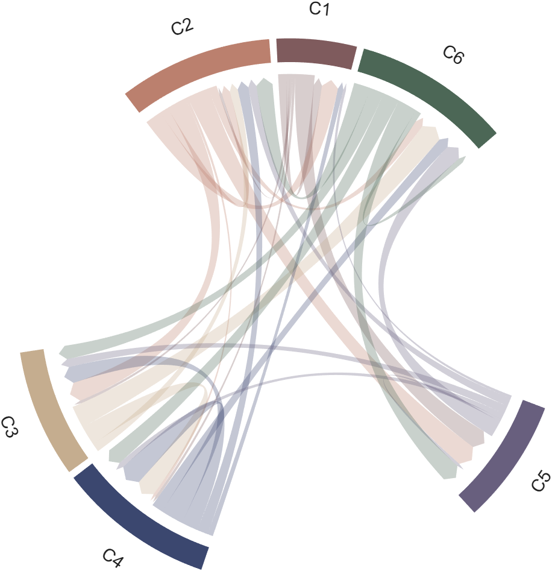


## 7 颜色的设置(Set color)

可在draw绘图之前设置`CData`属性修改颜色，例如：\
You can modify the color by setting the `CData` property before calling `draw`, for example:
```matlab
dataMat = randi([0, 8], [6, 6]);

ColorList = [127,91,93;153,66,83;95,127,95;9,14,10;78,70,83;0,0,0]./255;
BCC = biChordChart(dataMat, 'Arrow','on', 'CData',ColorList);
BCC = BCC.draw();
```
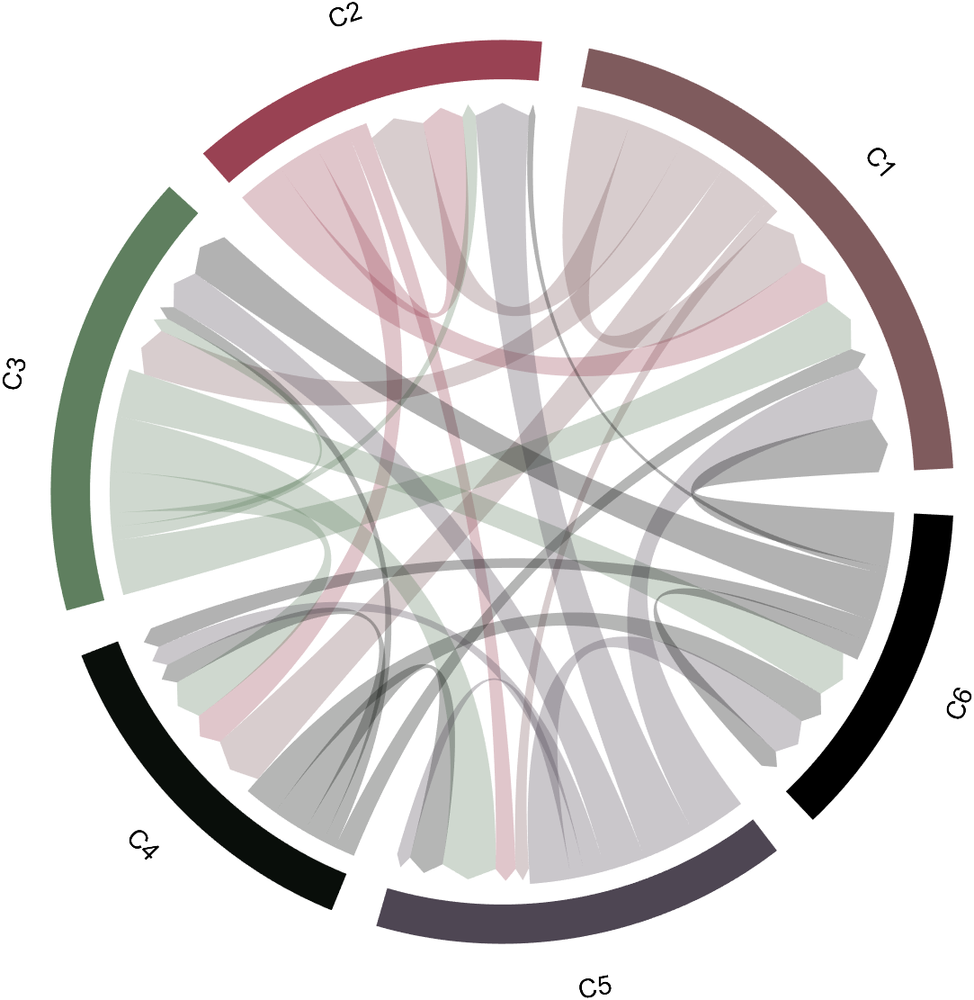
```matlab
dataMat = randi([0, 8], [6, 6]);

BCC = biChordChart(dataMat, 'Arrow','on', 'CData',bone(9));
BCC = BCC.draw();
```
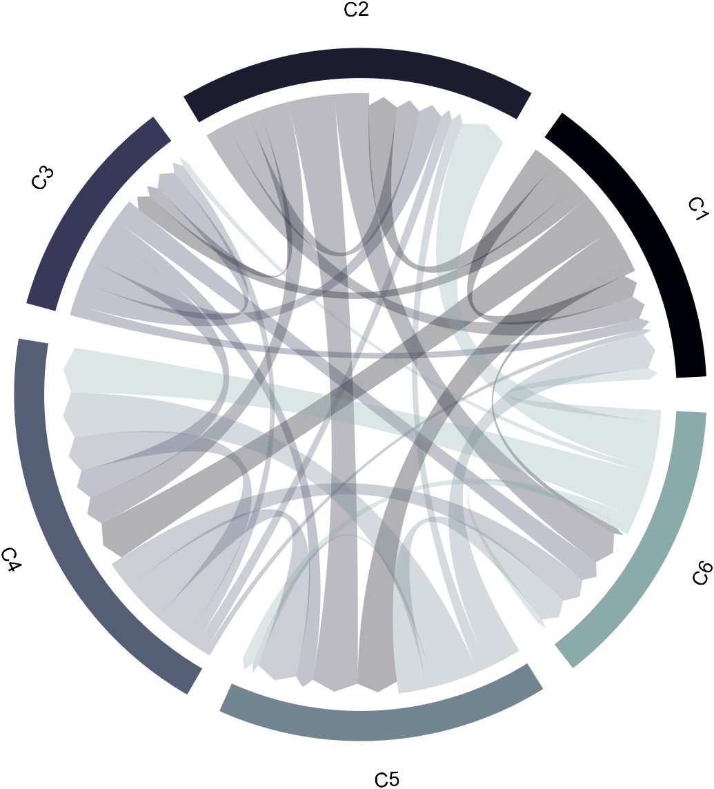

值得一提的是如果`CData`设置为空集，则会随机生成颜色：\
It is worth noting that if `CData` is set to an empty set, colors will be generated randomly.
```matlab
dataMat = randi([0,8],[6,6]);

BCC = biChordChart(dataMat, 'Arrow','on', 'CData',[]);
BCC = BCC.draw();
```

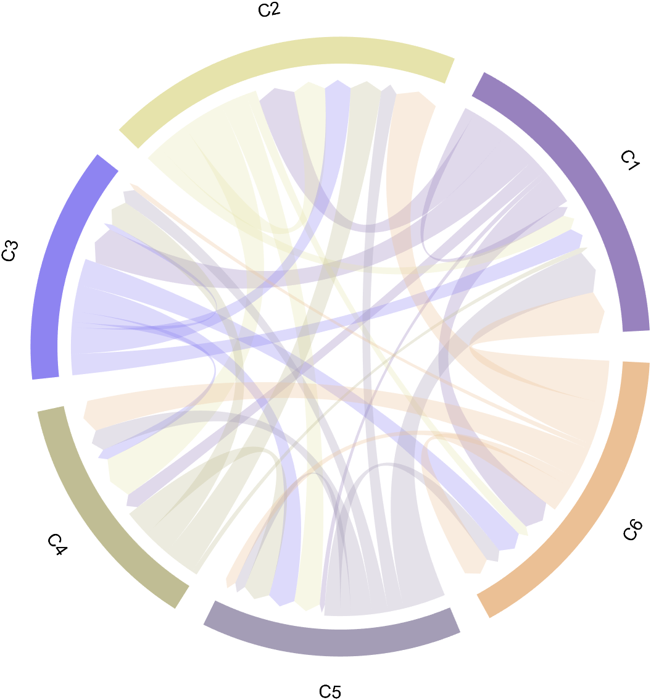

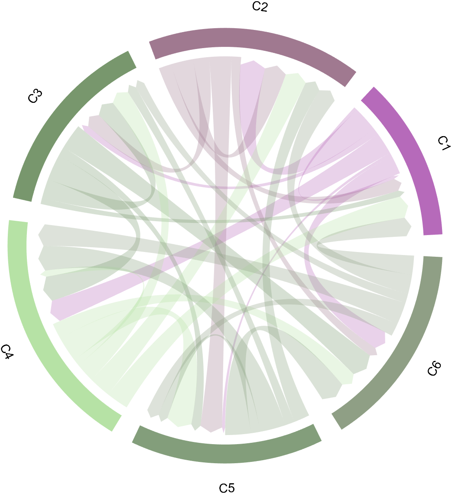

## 8 Colormap
使用 BCC.setChordCData(dataMat) 函数将弦的颜色与 dataMat 数值关联，之后可以设置 colormap :\

## 8 弧块及弦属性设置(Set properties for blocks or chords)
通过 
+ BCC.setSquare(n, ___)
+ BCC.setChordN(n, ___)

设置第n个弧块或第n类弦的属性，`Patch`对象具有的属性均可被设置，比如如果没提前定义颜色，可以比较麻烦的修改颜色：\
Sets the attributes for the *n*-th arc patch or the *n*-th category of chords. Any attribute possessed by a `Patch` object can be set; for instance, if a color was not defined beforehand, it can be modified—albeit somewhat laboriously—as follows:
```matlab
dataMat = randi([0, 8], [6, 6]);

BCC = biChordChart(dataMat, 'Arrow','on');
BCC = BCC.draw();

ColorList = lines(6);
for i = 1:6
    BCC.setSquare(i, 'FaceColor',ColorList(i,:))
    BCC.setChordN(i, 'FaceColor',ColorList(i,:))
end
```
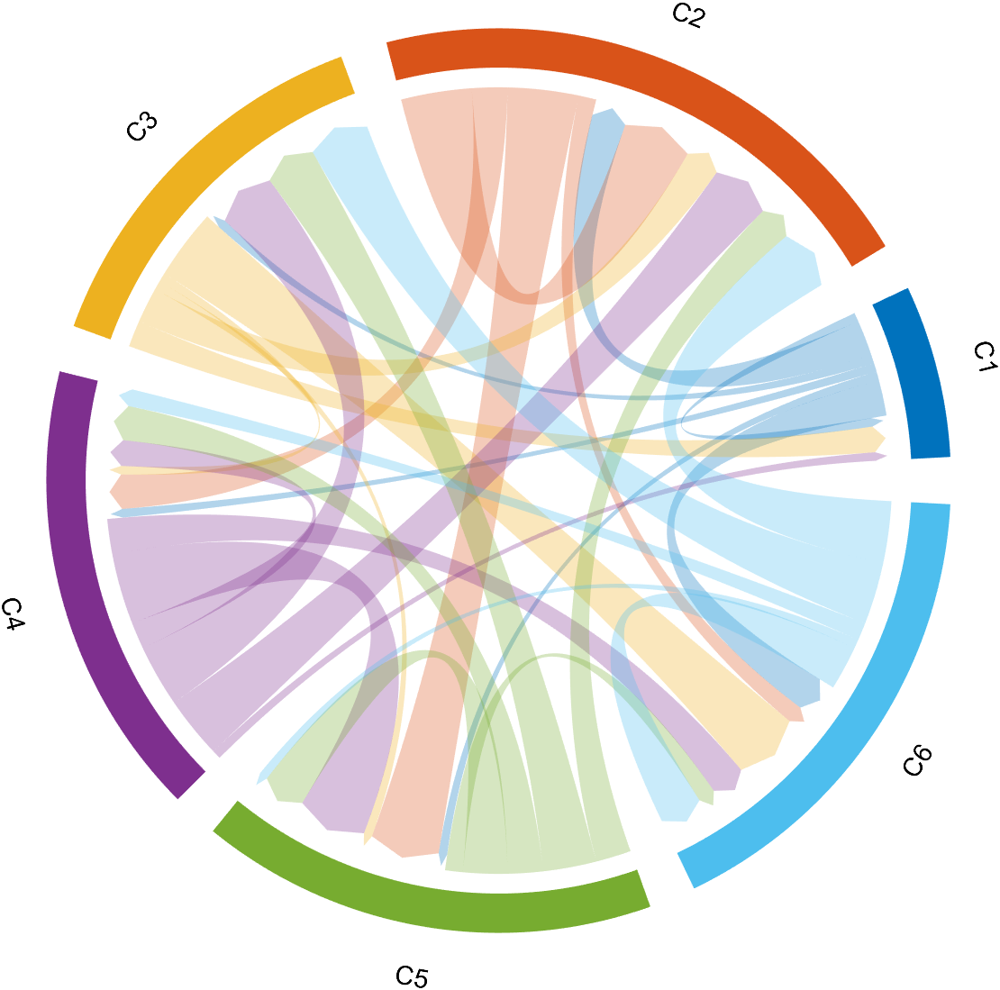

使用函数：
+ setChord(m, n, ___)

函数可以单独修饰类 m 到类 n 的属性，例如找到比较大的弦并将边缘标记为红色：\
You can individually modify the attributes of elements ranging from class m to class n—for example, by identifying larger chords and marking their edges in red:
```matlab
dataMat = randi([0, 8], [6, 6]);

BCC = biChordChart(dataMat, 'Arrow','on');
BCC = BCC.draw();

% 标记最大值弦
[m, n] = find(dataMat == max(max(dataMat)));
for i = 1:length(m)
    BCC.setChord(m(i), n(i), 'EdgeColor',[.8,0,0], 'LineWidth',2)
end
```
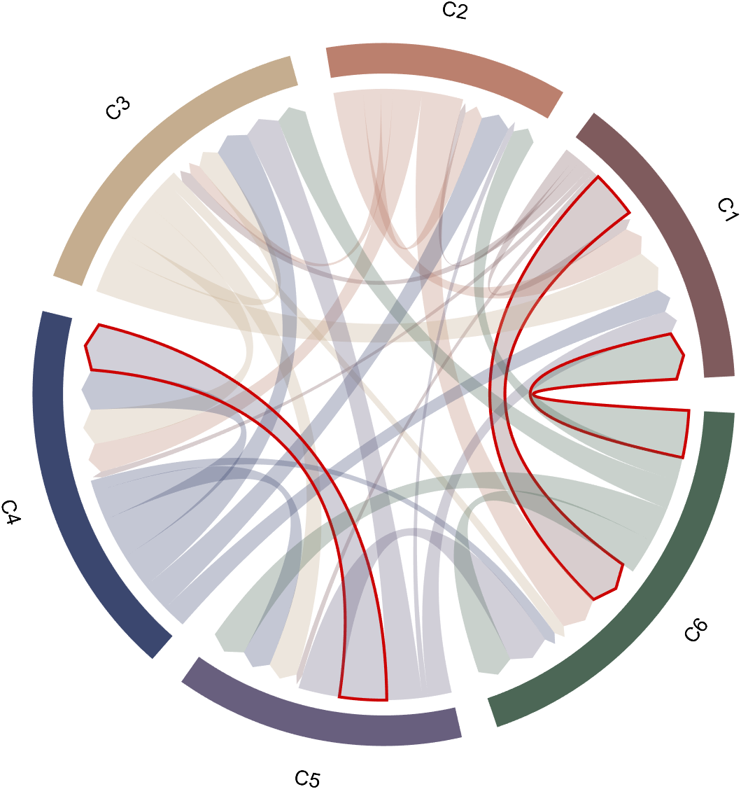

## 9 字体设置(Set font for labels)
通过:
+ setFont

函数进行字体设置：
```matlab
dataMat = randi([0, 8], [6, 6]);

BCC = biChordChart(dataMat, 'Arrow','on');
BCC = BCC.draw();

% 修改字体，字号及颜色
BCC.setFont('FontName','Cambria', 'FontSize',30, 'Color',[0,0,.8])
```
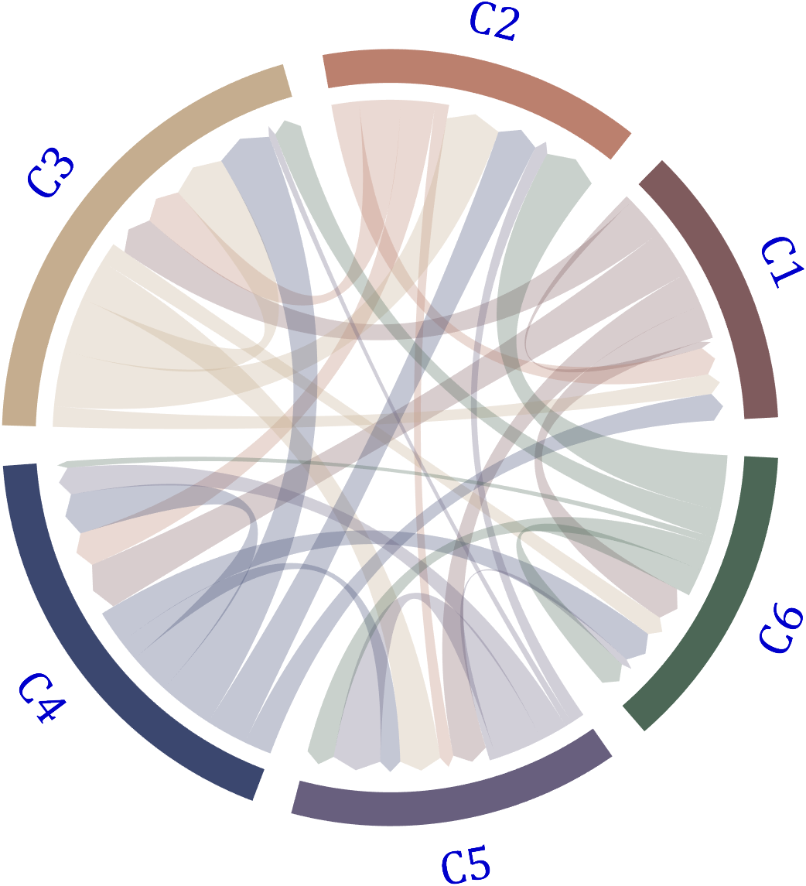
___

## 10 添加刻度标签,调整类标签距离(Add tick labels and adjust the spacing of class labels.)
通过：

+ setLabelRadius 调整类标签半径
+ tickLabelState 调整刻度标签开关
+ setTickFont 调整刻度标签字体

By using:

+ `setLabelRadius` to adjust the radius of class labels
+ `tickLabelState` to toggle tick labels on/off
+ `setTickFont` to adjust the tick label font

```matlab
dataMat = [5 1 0 2;
           0 7 6 3;
           1 3 4 1;
           7 6 8 8];
BCC = biChordChart(dataMat, 'Arrow','on');
BCC = BCC.draw();

% 修改字体，字号及颜色(Set font for labels)
BCC.setFont('FontName','Cambria','FontSize',17)

% 调节标签半径
% Adjustable Label radius
BCC.setLabelRadius(1.3);

% 显示刻度和数值
% Displays scales and numeric values
BCC.tickState('on')
BCC.tickLabelState('on')

BCC.setTickFont('FontName','Cambria', 'Color',[0,0,.6])


figure()
dataMat = [5.213 1.231 0.000 2.835;
           0.000 7.674 6.565 3.085;
           1.534 3.676 4.467 1.654;
           7.647 6.111 8.772 8.561];
BCC=biChordChart(dataMat,'Arrow','on');
BCC=BCC.draw();

% 修改字体，字号及颜色(Set font for labels)
BCC.setFont('FontName','Cambria', 'FontSize',17)

% 调节标签半径
% Adjustable Label radius
BCC.setLabelRadius(1.4);

% 显示刻度和数值
% Displays scales and numeric values
BCC.tickState('on')
BCC.tickLabelState('on')
```
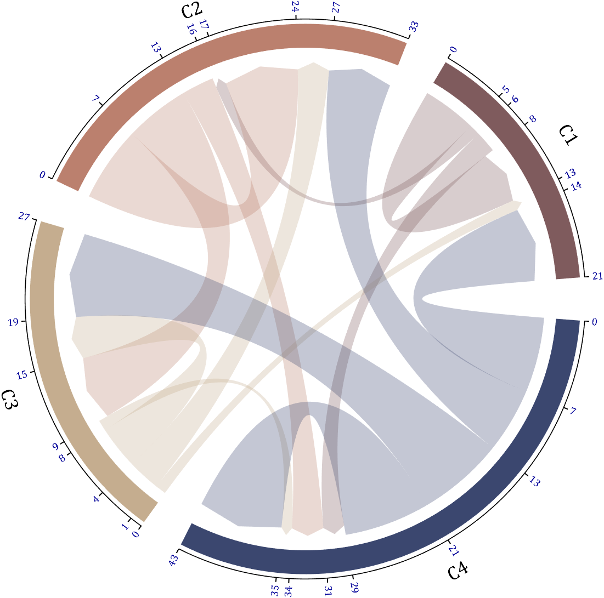
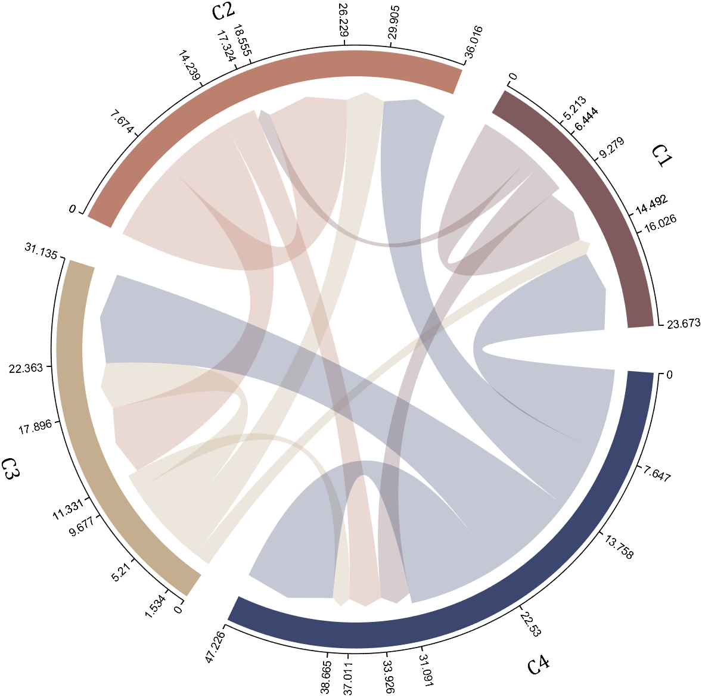
___
## 11 刻度标签格式自定义(Custom tick label formatting)
需要一个输入数值输出字符串的匿名函数，通过setTickLabelFormat函数可设置格式，比如科学计数法：\
An anonymous function is required that takes a numerical input and outputs a string; the format can be configured using the `setTickLabelFormat` function—for instance, using scientific notation.
```matlab
dataMat = [5.213 1.231 0.000 2.835;
           0.000 7.674 6.565 3.085;
           1.534 3.676 4.467 1.654;
           7.647 6.111 8.772 8.561].*1e15;
BCC = biChordChart(dataMat, 'Arrow','on');
BCC = BCC.draw();

% 修改字体，字号及颜色
BCC.setFont('FontName','Cambria', 'FontSize',17)

% 调节标签半径
% Adjustable Label radius
BCC.setLabelRadius(1.4);

% 显示刻度和数值
% Displays scales and numeric values
BCC.tickState('on')
BCC.tickLabelState('on')


% 调整数值字符串格式
% Adjust numeric string format
BCC.setTickLabelFormat(@(x)sprintf('%0.1e',x))
```
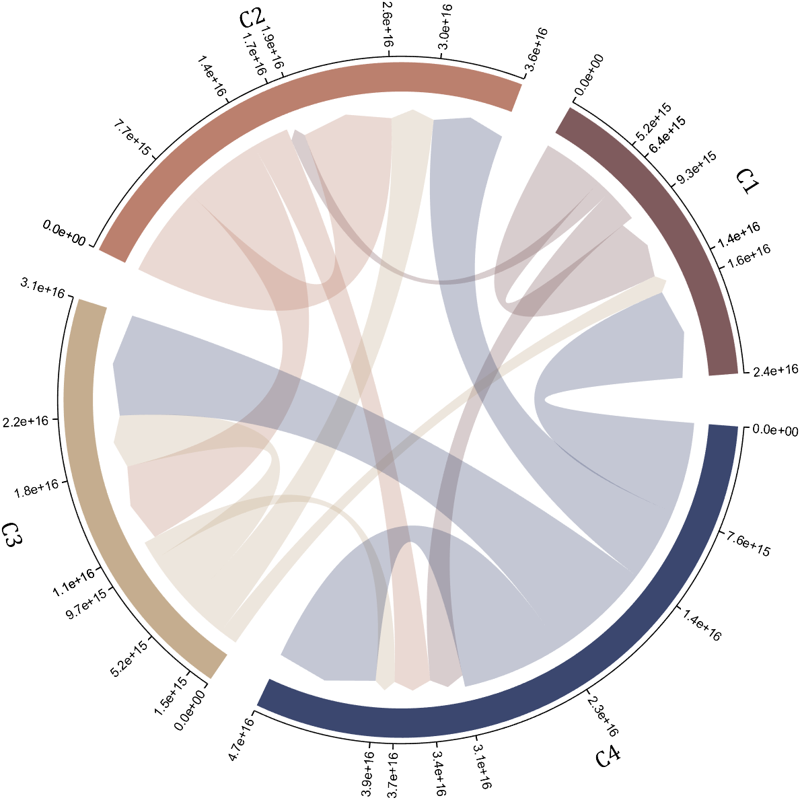

# Check out the various demos for more detailed usage instructions.
___
# 封面绘制(How to draw the cover)
```matlab
dataMat = randi([0, 8], [6, 6]);

% 添加标签名称
NameList = {'CHORD','CHART','MADE','BY','SLANDARER','MATLAB'};
BCC = biChordChart(dataMat, 'Label',NameList, 'Arrow','on');
BCC = BCC.draw(); 

% 添加刻度
BCC.tickState('on')

% 修改字体，字号及颜色
BCC.setFont('FontName','Cambria', 'FontSize',17, 'Color',[.2,.2,.2])

% version 1.1.0更新
% 函数labelRotate用来旋转标签
% The function labelRatato is used to rotate the label
% BCC.labelRotate('on')

BCC.setLabelRadius(1.3);
BCC.tickLabelState('on')
```


# star me please!

非常短的代码就能绘制出效果不错的图！！

MATLAB弦图绘制能画成这样属实不易，如果有用请留个star叭~

未经允许本代码请勿作商业用途，引用的话可以引用我file exchange上的链接，可使用如下格式：

Zhaoxu Liu (2024). Digraph chord chart 有向弦图 (https://www.mathworks.com/matlabcentral/fileexchange/121043-digraph-chord-chart), MATLAB Central File Exchange. 检索来源 2024/3/31.