# 封面图 (Cover)


___

# 使用教程 (User guide)
## 1 数据格式 (Data format)

数据要求为全部数值大于等于0的数值矩阵，或者`table`数组，或者数值矩阵+行列名元胞数组，首先举个数值矩阵的例子：

The data input must be a numeric matrix where all values ​​are greater than or equal to 0, 
a `table` array, or a numeric matrix with cell arrays for row and column names also works. 

First, let's look at an example using a numeric matrix:

### 数值矩阵 (Numeric matrix)
```matlab
dataMat = randi([0, 5], [5, 4]); 

CC = chordChart(dataMat);
CC = CC.draw();
```


由于没对各个对象命名，因此会自动命名为`Rn`和`Cn`\
Since the individual objects were not explicitly named, they will be automatically named `Rn` and `Cn`.
### 数值矩阵+行列名元胞数组 (Numeric matrix with cell arrays for row and column names)
这是最推荐的一种格式：
```matlab
dataMat = [2 0 1 2 5 1 2;
           3 5 1 4 2 0 1;
           4 0 5 5 2 4 3];
colName = {'G1','G2','G3','G4','G5','G6','G7'};
rowName = {'S1','S2','S3'};

CC = chordChart(dataMat, 'RowName',rowName, 'ColName',colName);
CC = CC.draw();
```


`RowName`要和矩阵的行相同大小\
`ColName`要和矩阵的列相同大小\
对于本列子来说第2行第3列数值是1，就说明有一份能量从`S1`流向`G3`，也就在这俩之间需要画单位宽度的弦。

`RowName` must be of the same size as the rows of the matrix.\
`ColName` must be of the same size as the columns of the matrix.\
In this specific example, the value at the second row and third column is 1; 
this indicates that a unit of energy flows from `S1` to `G3`, 
implying that a chord of unit width must be drawn between these two entities.

### table 数组
需要使用如下格式的table数组：\
You need to use a table array in the following format:
```matlab
% ans =
% 
%   3×7 table
% 
%           G1    G2    G3    G4    G5    G6    G7
%           __    __    __    __    __    __    __
% 
%     S1    2     0     1     2     5     1     2 
%     S2    3     5     1     4     2     0     1 
%     S3    4     0     5     5     2     4     3 
```
当然，如果各个行没有命名的话依旧会自动命名的。
___

## 2 方块修饰 (Square decoration)
### 方块批量修饰 (Batch modification of squares)
使用
+ setSquareT(___)
+ setSquareS(___)


分别修饰上方方块和下方方块，一切Patch对象所具有的属性均可以被修饰，举个例子，上方方块批量修饰(改为黑色)：\
S means source, which is the square belows, and T means target, wich is the square aboves. For example, batch-modifying the squares above (changing them to black):

```matlab
CC.setSquareT('FaceColor',[0,0,0])
```


### 方块单独修饰 (Individual modification of squares)
使用:
+ setSquareT(n, ___)
+ setSquareS(n, ___)

分别修饰上方方块和下方方块，举个例子，上方第二个方块单独修饰(改为红色)：\
Set the n-th square. For example, the second square from the top is modified individually (changed to red):

```matlab
CC.setSquareT(2,'FaceColor',[.8,0,0])
```

### 为不同方块设置不同颜色的简洁方法 (A concise way to assign different colors to different blocks)
使用:
+ setSquareColorT(CListT)
+ setSquareColorS(CListS)

分别批量为上方下方方块修改颜色：\
Batch-modify colors for upper and lower squares separately.
```matlab
% Modify the color of the blocks above (修改上方方块颜色)
CListT = [0.75,0.73,0.86; 0.56,0.83,0.78; 0.00,0.60,0.20; 1.00,0.49,0.02
    0.78,0.77,0.95; 0.59,0.24,0.36; 0.98,0.51,0.45];
CC.setSquareColorT(CListT)
% Modify the color of the blocks below (修改下方方块颜色)
CListS = [0.93,0.60,0.62; 0.55,0.80,0.99; 0.95,0.82,0.18; 1.00,0.81,0.91];
CC.setSquareColorS(CListS)
```
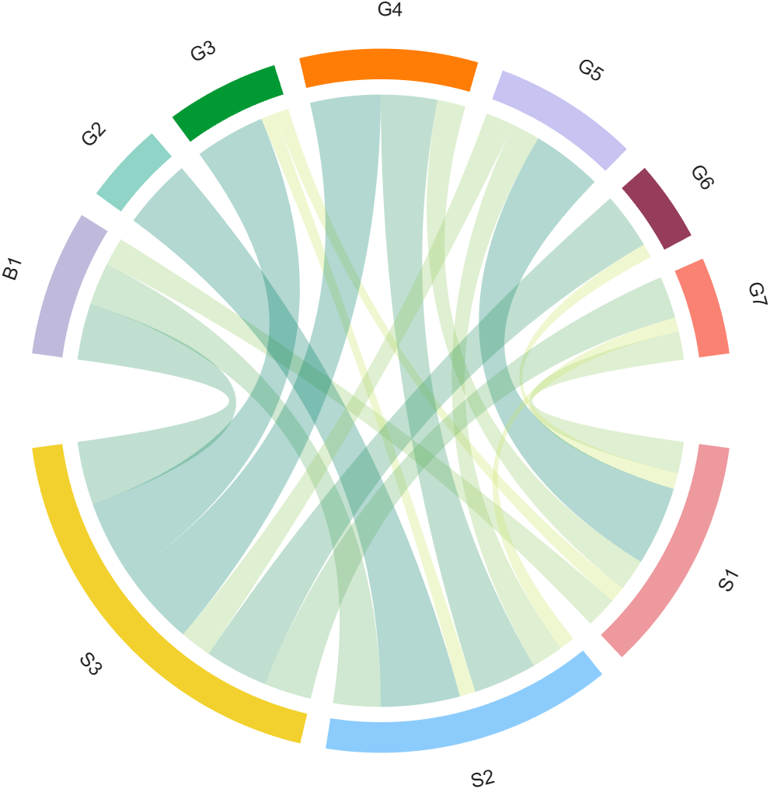
### 为方块设置 CData (Set CData property for squares)
+ setSquareCData(CVal)
+ setSquareCData(CVal)
```matlab
CC.setSquareCDataS(dataMat(:, 1))
CC.setSquareCDataT(dataMat(1, :))
```
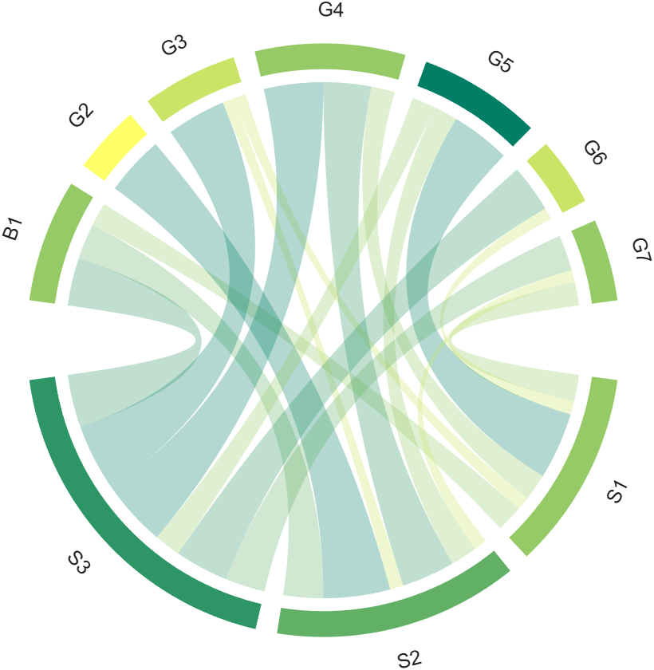
___
## 3 修饰弦 (Set properties for chords)
### 弦的批量修饰 (Batch modification of chords)
弦的批量修饰可以使用`setChord(___)`函数，一切Patch对象所具有的属性均可以被修饰，举个例子(修饰一下弦的颜色，边缘颜色，边缘线形状等)：\
Batch modification of chords can be performed using the `setChord(___)` function; any property possessed by a Patch object can be modified. For example (modifying the chord color, edge color, edge line shape, etc.):
```matlab
CC.setChord('EdgeColor',[.3,.3,.3], 'LineStyle','--',...
    'LineWidth',.1, 'FaceColor',[.3,.3,.3])
```


### 弦的单独修饰 (Individual modification of chords)
弦的单独修饰可以使用`setChord(m, n, __)`函数，其中 m,n 值是和原始数值矩阵的行列完全对应的,举个例子(把`S2`流向`G4`的弦颜色更改为红色)：\
Individual chords can be styled using the `setChord(m, n, __)` function, where the values ​​of `m` and `n` correspond exactly to the rows and columns of the original numerical matrix. For example (to change the color of the chord flowing from `S2` to `G4` to red):
```matlab
CC.setChord(2,4, 'FaceColor',[1,0,0])
```


### 使用布尔矩阵设置弦属性 (Use bool matrix to set chord properties)
```matlab
CC.setChord(dataMat >= 5, 'EdgeColor','k', 'LineWidth',2)
```
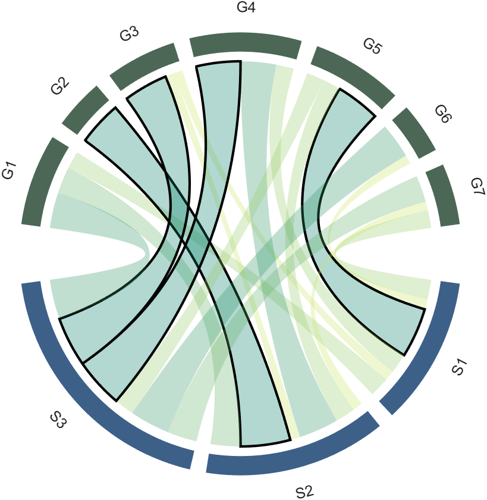

### 弦的颜色映射 (colormap)
```matlab
colormap(copper(100))
```


### 带负数的弦的颜色映射 (colormap with negative value)
```matlab
dataMat = [ 2  0 -1  2 -5 1 -2;
           -3 -5  1 -4  2 0  1;
            4  0  5 -5 -2 4  3];
colName = {'G1','G2','G3','G4','G5','G6','G7'};
rowName = {'S1','S2','S3'};

CC = chordChart(dataMat, 'RowName',rowName, 'ColName',colName,  'LRadius',1.28);
CC = CC.draw();

% Set chord color data to the matrix values (将弦颜色数据设为矩阵值)
CC.setChordCData(dataMat)

CC.setChord('FaceAlpha',.5)

clim([-5, 5])
cmp = [.23,.30,.75; .38,.51,.92; .55,.69,1.0;
       .72,.81,.98; 1.0,1.0,1.0; .96,.77,.68;
       .96,.60,.48; .87,.38,.30; .71,.02,.15];
colormap(cmp)
colorbar()
```
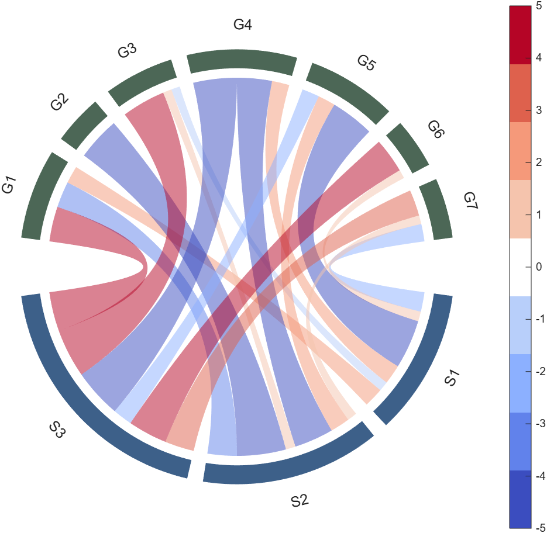

### 箭头 (Arrow)
```matlab
dataMat = [2 0 1 2 5 1 2;
           3 5 1 4 2 0 1;
           4 0 5 5 2 4 3];

CC = chordChart(dataMat, 'Arrow','on');
CC.draw();
```
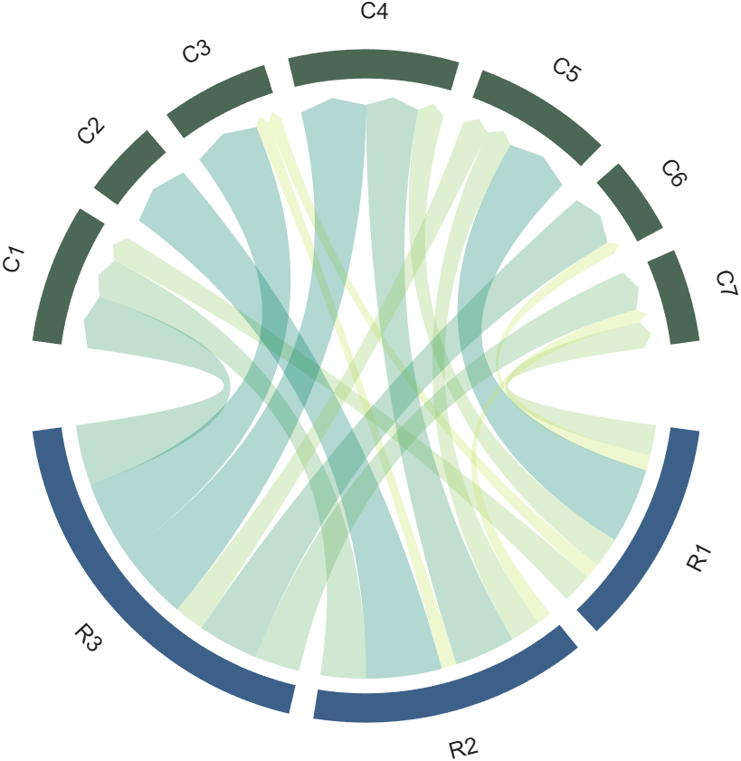
### 高亮箭头 (Highlight arrow)
```matlab
CC.addHighlightArrow(3, 4)
CC.addHighlightArrow(2, 2, [0,0,.8])
```
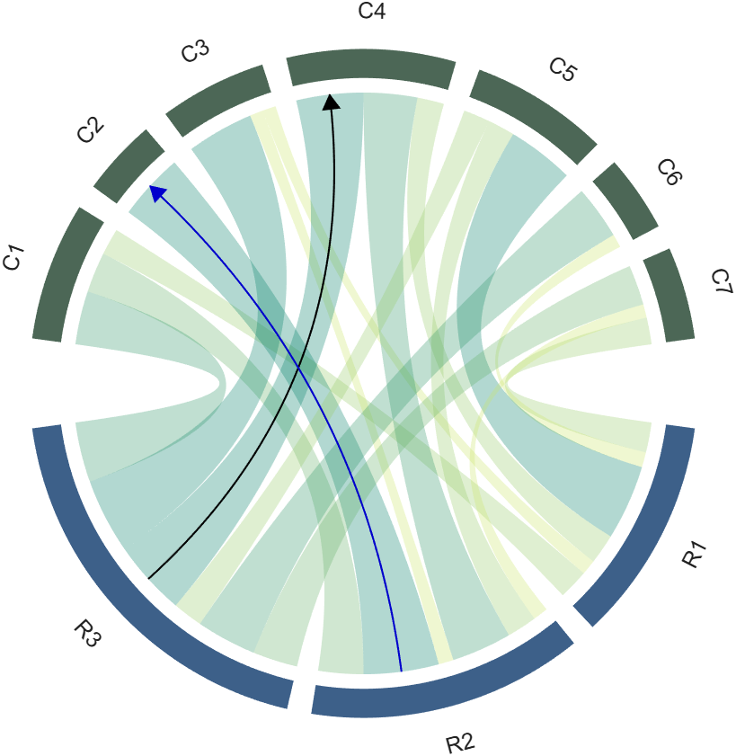

### 为弦设置颜色的简洁方法 (A concise way to assign colors to chord)
+ setChordColorBySquareT()
+ setChordColorBySquareS()
```matlab
dataMat = [2 0 1 2 5 1 2;
           3 5 1 4 2 0 1;
           4 0 5 5 2 4 3];
colName = {'B1','G2','G3','G4','G5','G6','G7'};
rowName = {'S1','S2','S3'};

% Create and render chord diagram object (创建弦图对象并渲染)
CC = chordChart(dataMat, 'RowName',rowName, 'ColName',colName);
CC.draw();

% Modify the color of the blocks above (修改上方方块颜色)
CListT = [0.75,0.73,0.86; 0.56,0.83,0.78; 0.00,0.60,0.20; 1.00,0.49,0.02
    0.78,0.77,0.95; 0.59,0.24,0.36; 0.98,0.51,0.45];
CC.setSquareColorT(CListT)
% Modify the color of the blocks below (修改下方方块颜色)
CListS = [0.93,0.60,0.62; 0.55,0.80,0.99; 0.95,0.82,0.18; 1.00,0.81,0.91];
CC.setSquareColorS(CListS)
```
```matlab
CC.setChordColorBySquareT()
```
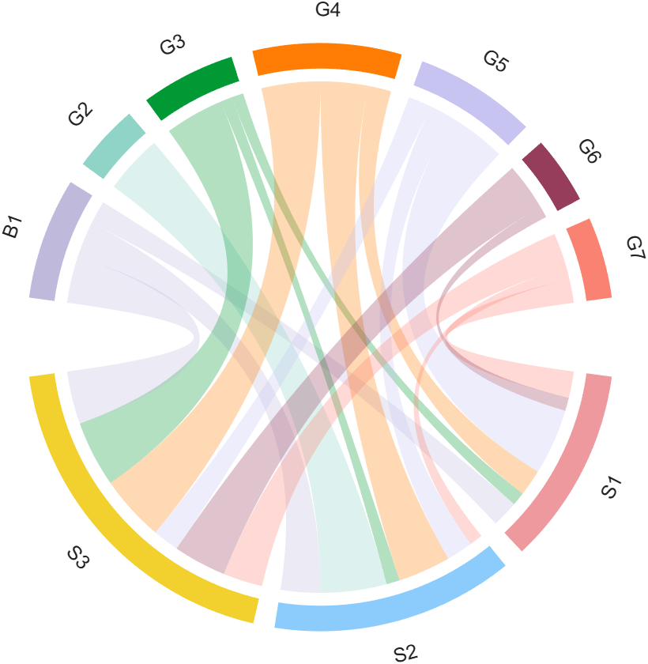
```matlab
CC.setChordColorBySquareS()
```
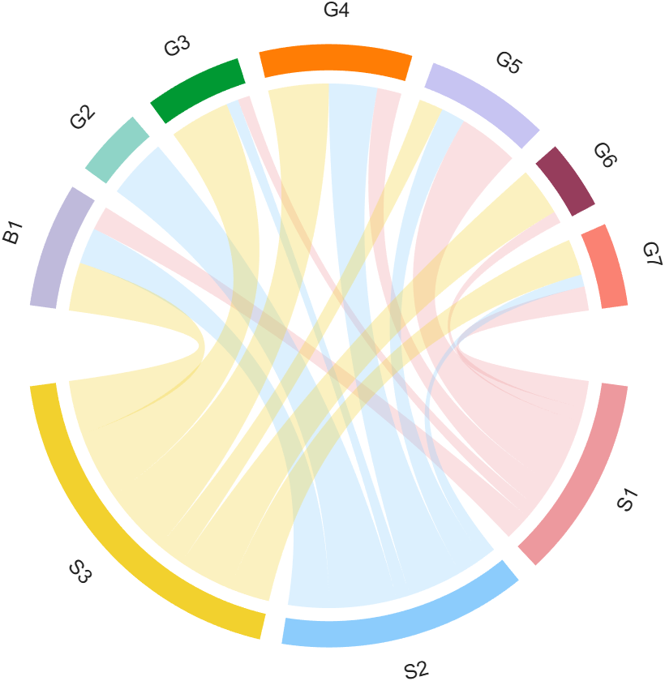
___
## 4 标签 (Labels)

### 字体调整 (Set font)
使用`setFont`函数对字体进行调整，所有text对象具有的属性均可以修饰，举个例子(更改文本的字号、字体和颜色)：Use the `setFont` function to adjust the font; any property possessed by a text object can be modified. For example (changing the text size, font, and color):
```matlab
CC.setFont('FontSize',30, 'FontName','Cambria', 'Color',[0,0,.8])
```


### 标签旋转 (Label rotate) 
使用函数`labelRotate`旋转标签：
```matlab
dataMat = [2 0 1 2 5 1 2;
           3 5 1 4 2 0 1;
           4 0 5 5 2 4 3];
rowName = {'Row-AAAAA','Row-BBBBB','Row-CCCCC'};
colName = compose('Col-Class%d', 1:7);
CC = chordChart(dataMat, 'RowName',rowName, 'ColName',colName);
CC.draw();
```
```matlab
CC.labelRotate('off')
```
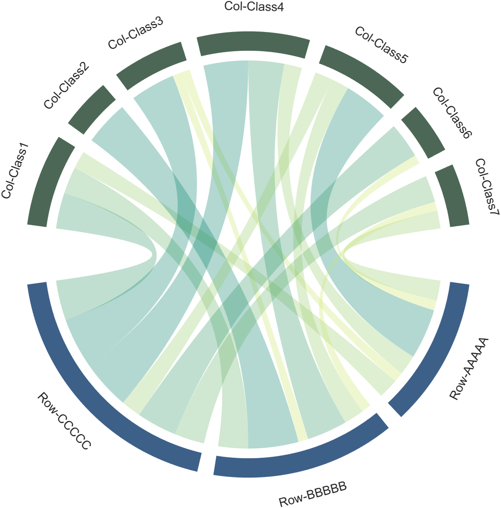
```matlab
CC.labelRotate('on')
```
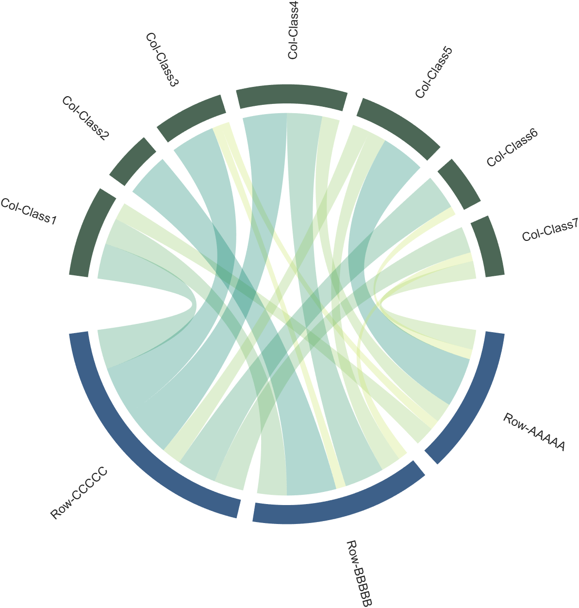
```matlab
CC.labelRotate('none')
```
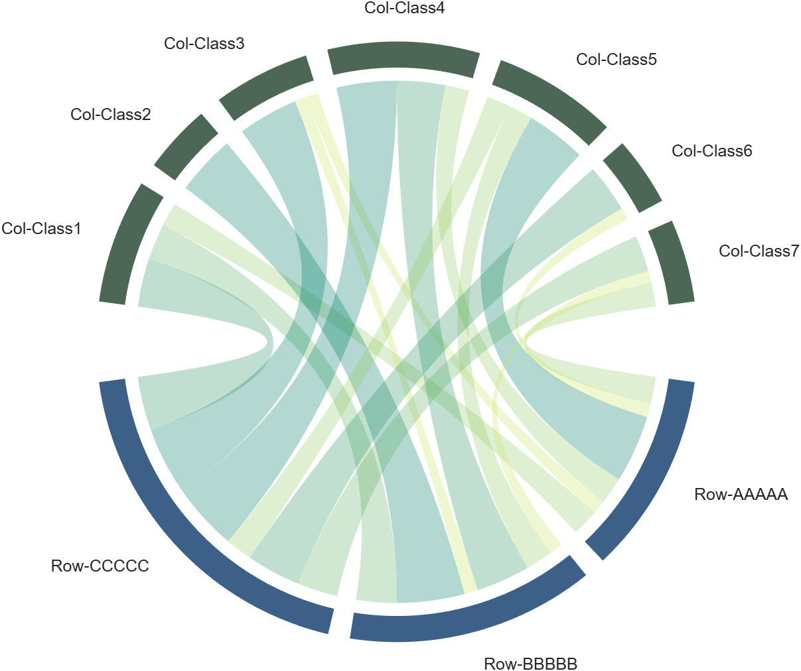


___
## 5 刻度及刻度标签 (Tick line and tick labels)

### 显示和隐藏刻度 (Show and Hide tick line)
```matlab
CC.tickState('on')
% CC.tickState('off')
```


### 刻度标签 (Tick labels)
通过：

+ setLabelRadius 调整节点标签半径
+ tickLabelState 调整刻度标签开关
+ setTickFont 调整刻度标签字体

By using:

+ `setLabelRadius` to adjust the radius of node labels
+ `tickLabelState` to toggle tick labels 'on'/'off'
+ `setTickFont` to adjust the tick label font

```matlab
dataMat = [2 0 1 2 5 1 2;
           3 5 1 4 2 0 1;
           4 0 5 5 2 4 3];
colName = {'G1','G2','G3','G4','G5','G6','G7'};
rowName = {'S1','S2','S3'};

CC = chordChart(dataMat, 'RowName',rowName, 'ColName',colName);
CC = CC.draw();
CC.setFont('FontSize',17, 'FontName','Cambria')

% 显示刻度和数值
% Displays scales and numeric values
CC.tickState('on')
CC.tickLabelState('on')

CC.setTickFont('Color',[0,0,.8], 'FontName','Cambria')

% 调节标签半径
% Adjustable Label radius
CC.setLabelRadius(1.3);


% figure()
% dataMat = [2 0 1 2 5 1 2;
%            3 5 1 4 2 0 1;
%            4 0 5 5 2 4 3];
% dataMat = dataMat + rand(3, 7);
% dataMat(dataMat < 1) = 0;
% 
% CC = chordChart(dataMat, 'RowName',rowName, 'ColName',colName);
% CC = CC.draw();
% CC.setFont('FontSize',17, 'FontName','Cambria')
% 
% % 显示刻度和数值
% % Displays scales and numeric values
% CC.tickState('on')
% CC.tickLabelState('on')
% 
% % 调节标签半径
% % Adjustable Label radius
% CC.setLabelRadius(1.4);
```


### 刻度标签格式自定义 (Custom tick label formatting)
需要一个输入数值输出字符串的匿名函数，通过setTickLabelFormat函数可设置格式，比如科学计数法：\
An anonymous function is required that takes a numerical input and outputs a string; the format—such as scientific notation—can be configured using the `setTickLabelFormat` function.

```matlab
dataMat = [2 0 1 2 5 1 2;
           3 5 1 4 2 0 1;
           4 0 5 5 2 4 3];
dataMat = dataMat+rand(3,7);
dataMat(dataMat < 1) = 0;
dataMat = dataMat.*1000;

CC = chordChart(dataMat);
CC = CC.draw();
CC.setFont('FontSize',17, 'FontName','Cambria')

% 显示刻度和数值
% Displays scales and numeric values
CC.tickState('on')
CC.tickLabelState('on')

% 调节标签半径
% Adjustable Label radius
CC.setLabelRadius(1.4);

% 调整数值字符串格式
% Adjust numeric string format
CC.setTickLabelFormat(@(x)sprintf('%0.1e',x))

```

___
## 8 布局 (Layout)
### 间隙 (Sep)
假如矩阵较大则绘图会比例失调：\
If the matrix is ​​large-scale, the plot will be disproportionate.
```matlab
dataMat = randi([0, 1], [20, 10]); 
CC = chordChart(dataMat);
CC = CC.draw();
```

通过`Sep`属性可调整绘图间隙，例如设置为特别小的1/120：\
The plotting gap can be adjusted using the `Sep` attribute—for example, by setting it to a particularly small value of 1/120:
```matlab
dataMat = randi([0, 1], [20, 10]); 
% use Sep to decrease space (separation)
% 使用 sep 减小空隙
CC = chordChart(dataMat, 'Sep',1/120);
CC = CC.draw();
```

### 组间隙 (GroupSep)
```matlab
dataMat = [2 0 1 2 5 1 2;
           3 5 1 4 2 0 1;
           4 0 5 5 2 4 3];
colName = {'B1','G2','G3','G4','G5','G6','G7'};
rowName = {'S1','S2','S3'};

% Create and render chord diagram object (创建弦图对象并渲染)
CC = chordChart(dataMat, 'RowName',rowName, 'ColName',colName, 'GroupSep',0);
CC.draw();

% Set Font for labels and show ticks (调整字体并显示刻度)
CC.setFont('FontSize',17, 'FontName','Cambria')
CC.tickState('on')
CC.tickLabelState('on')
```
GroupSep = 0
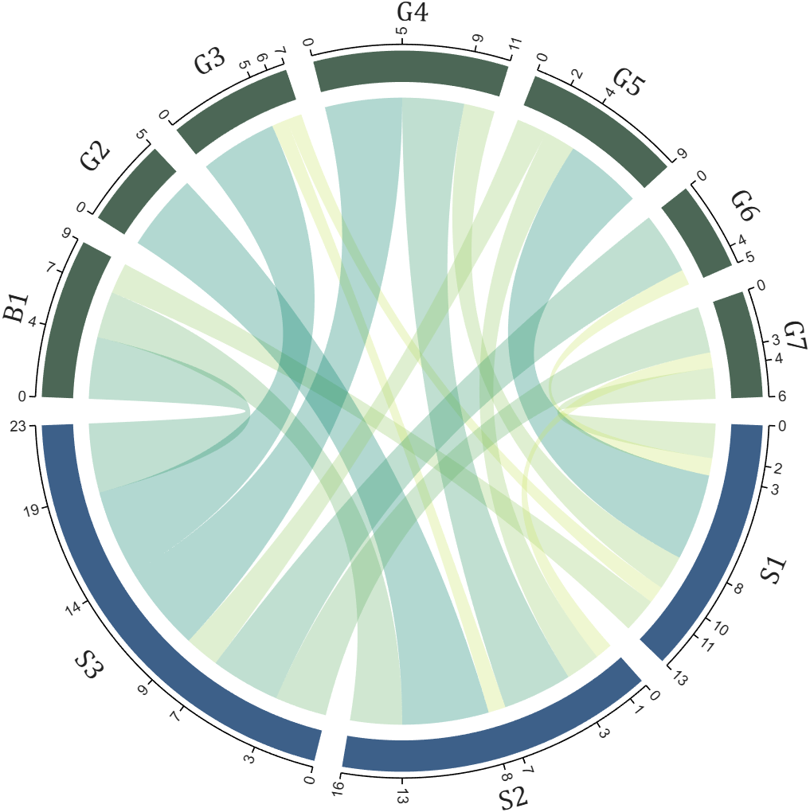
GroupSep = 1/2
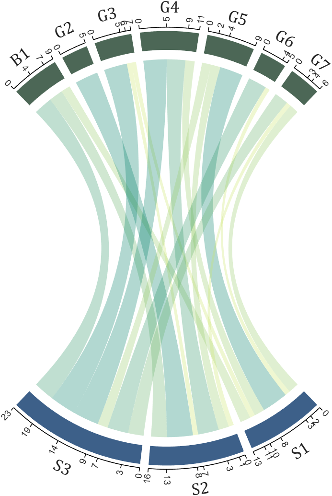
### 整体旋转 (Global roatation)
```matlab
CC = chordChart(dataMat, 'RowName',rowName, 'ColName',colName, 'GroupSep',1/5);
CC.Rotation = pi/4;
CC.draw();
```
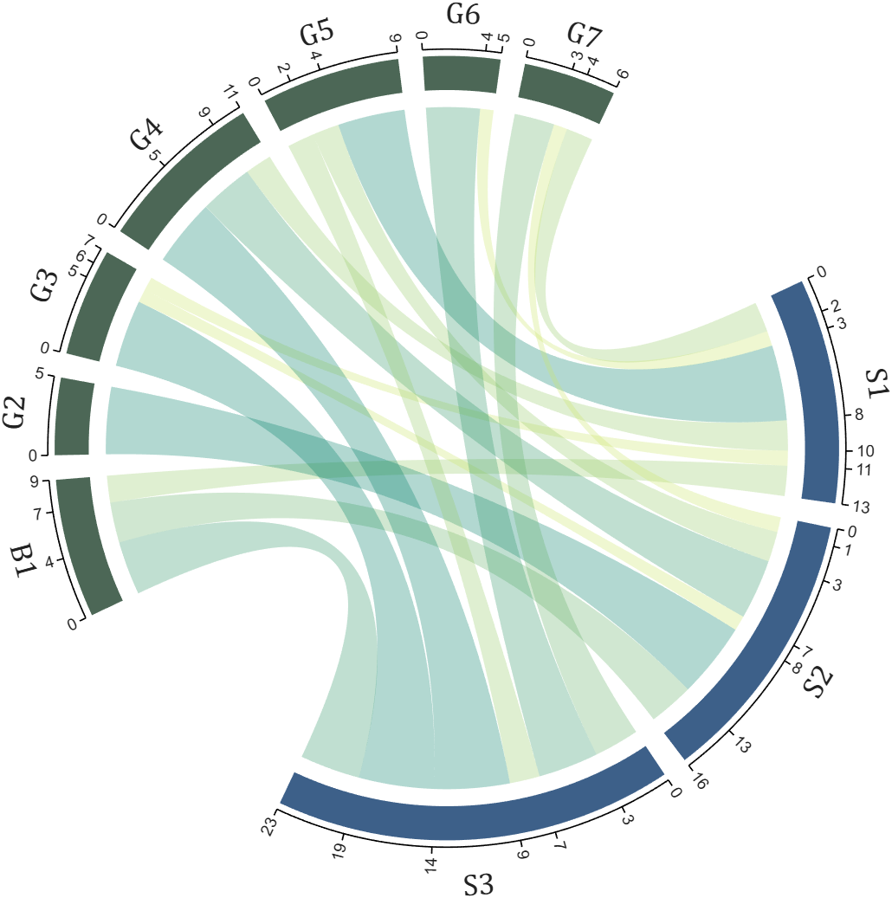
### 方块、刻度、标签半径与方块占比 (Square, tick, label radius | square ratio)
```matlab
dataMat = [2 0 1 2 5 1 2;
           3 5 1 4 2 0 1;
           4 0 5 5 2 4 3];

CC = chordChart(dataMat, 'GroupSep', 1/5);

% See radius&ratio.png for details
CC.OSqRatio = .4;           % CC.OriSquareRatio = .4;
CC.SSqRatio = .4;           % CC.SubSquareRatio = .4;
CC.SRadius = [1.1, 1.4];    % CC.SquareRadius = [1.1, 1.4];
CC.TRadius = 1.5;           % CC.TickRadius = 1.5;
CC.LRadius = 1.7;           % CC.LabelRadius = 1.7;
CC = CC.draw();

% Modify the color of the blocks above (修改上方方块颜色)
CListT = [0.75,0.73,0.86; 0.56,0.83,0.78; 0.00,0.60,0.20; 1.00,0.49,0.02
          0.78,0.77,0.95; 0.59,0.24,0.36; 0.98,0.51,0.45];
CC.setSquareColorT(CListT)
% Modify the color of the blocks below (修改下方方块颜色)
CListS = [0.93,0.60,0.62; 0.55,0.80,0.99; 0.95,0.82,0.18; 1.00,0.81,0.91];
CC.setSquareColorS(CListS)
% Modify chord color (修改弦颜色)
CC.setChordColorBySquareT()
% Displays scales and numeric values (显示刻度和数值)
CC.tickState('on')
CC.tickLabelState('on')

set(gca,'XLim',[-1.8,1.8], 'YLim',[-1.8,1.8])
```
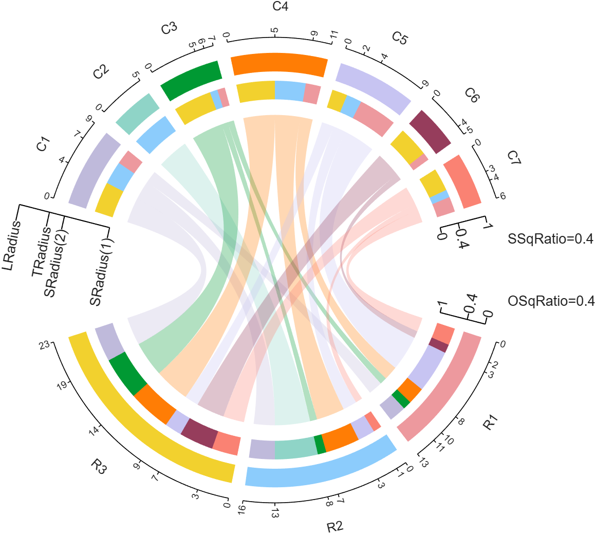
___
## 9 常用示例 (Common examples)
### 设置原方形占比及子方形占比 (Set ori-square ratio and sub-square ratio)
```matlab
dataMat = round(10.*rand([11,4]).*((11:-1:1).'+1))./10;
colName = {'A','B','C','D'};
rowName = {'Acidobacteriota', 'Actinobacteriota', 'Proteobacteria', ...
           'Chloroflexi', 'Bacteroidota', 'Firmicutes', 'Gemmatimonadota', ...
           'Verrucomicrobiota', 'Patescibacteria', 'Planctomyetota', 'Others'};

figure('Units','normalized', 'Position',[.02,.05,.8,.85])
CC = chordChart(dataMat, 'ColName',colName, 'Sep',1/80, 'SSqRatio',-30/100, 'OSqRatio',80/100);
CC.RowName = repmat({' '}, [1, length(rowName)]);
CC = CC.draw();

% Modify the color of the blocks above (修改上方方块颜色)
CListT = [.93,.60,.62; .55,.80,.99; .95,.82,.18; 1.0,.81,.91];
CC.setSquareColorT(CListT)
% Modify the color of the blocks below (修改下方方块颜色)
CListS = [.75,.73,.86; .56,.83,.78; .00,.60,.20; 1.0,.49,.02; .78,.77,.95; .59,.24,.36; 
          .98,.51,.45; .96,.55,.75; .47,.71,.84; .65,.35,.16; .40,.00,.64];
CC.setSquareColorS(CListS)
% Modify chord color (修改弦颜色)
% CC.setChordColorBySquareS()
CC.setChordColorBySquareT()

CC.tickState('on')
CC.setFont('FontName','Cambria', 'FontSize',17)

% Draw legend (绘制图例)
lgdHdl = legend(CC.squareFHdl, rowName, 'Location','eastoutside', ...
    'FontSize',16, 'FontName','Cambria', 'Box','off');
lgdHdl.ItemTokenSize = [18,8];
```
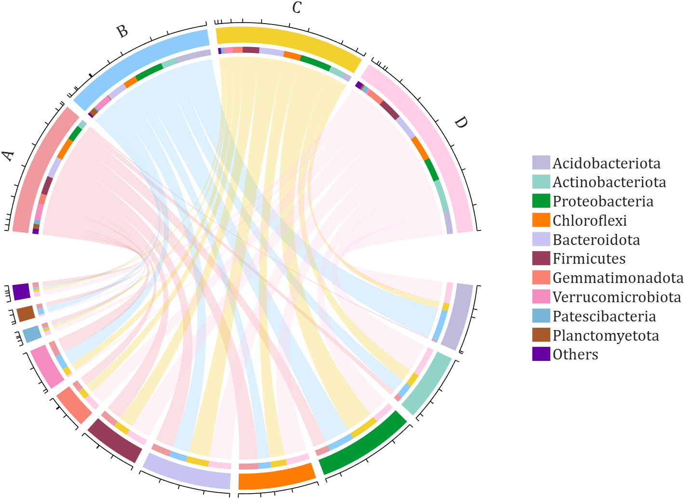
### 旋转及方块 CData (Rotation and square CData)
```matlab
dataMat = rand([14,5]) > .3;
colName = {'phosphorylation', 'vasculature development', 'blood vessel development', ...
           'cell adhesion', 'plasma membrane'};         
rowName = {'THY1', 'FGF2', 'MAP2K1', 'CDH2', 'HBEGF', 'CXCR4', 'ECSCR',...
           'ACVRL1', 'RECK', 'PNPLA6', 'CDH5', 'AMOT', 'EFNB2', 'CAV1'};

figure('Units','normalized', 'Position',[.02,.05,.9,.85])
CC = chordChart(dataMat, 'ColName',colName, 'RowName',rowName, 'Sep',1/80, 'LRadius',1.2, 'Rotation',3*pi/2).draw();

% Modify the color of the blocks above (修改上方方块颜色)
CListT = [0.47 0.58 0.75; 0.48 0.54 0.58; 0.65 0.72 0.65; 0.94 0.92 0.90; 0.98 0.76 0.68];
CC.setSquareColorT(CListT);
CC.setSquareT('EdgeColor',[0,0,0])
% Modify chord color (修改弦颜色)
CC.setChordColorBySquareT()
CC.setChord('FaceAlpha',.9, 'EdgeColor',[0,0,0])
% Modify the color of the blocks below (修改下方方块颜色)
logFC = sort(rand(1, 14))*6 - 3;
CC.setSquareCDataS(logFC)
CC.setSquareS('EdgeColor',[0,0,0])
set(CC.nameTHdl, 'Visible','off')
% A diverging red-white-blue colormap (一个红白蓝配色 colormap)
CMap = interp1([0,.5,1].', [0,0,1;1,1,1;1,0,0], linspace(0,1,50).');
colormap(CMap); clim([-3,3]); colorbar('Position', [.74,.29,.02,.2]);

% Draw legend
text([1.25, 1.25], [0, 1], {'LogFC', 'Terms'}, 'FontSize',16)
lgdHdl = legend(CC.squareTHdl, colName, 'Position',[.735,.6,.167,.2], 'FontSize',14, 'Box','off');
lgdHdl.ItemTokenSize = [20,16];
```
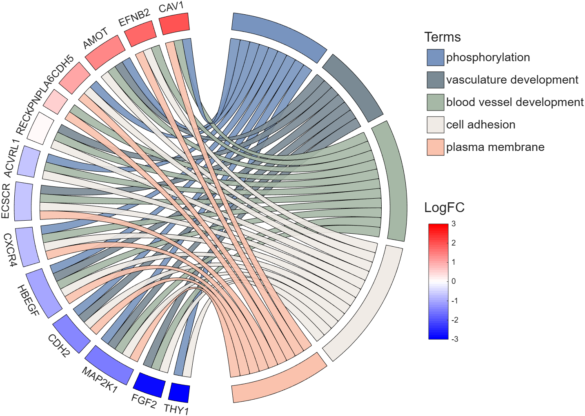
### 弦末端弧形块单独上色 (Color the sub-squares at the ends of the chords separately.)
```matlab
dataMat = randi([1, 15], [7, 22]); dataMat(dataMat < 11) = 0;
dataMat(1, sum(dataMat,1) == 0) = 15;
colName = {'A2M', 'FGA', 'FGB', 'FGG', 'F11', 'KLKB1', 'SERPINE1', 'VWF',...
           'THBD', 'TFPI', 'PLAT', 'SERPINA5', 'SERPIND1', 'F2', 'PLG', 'F12',...
           'SERPINC1', 'SERPINA1', 'PROS1', 'SERPINF2', 'F13A1', 'PROC'};
rowName = {'Lung', 'Spleen', 'Liver', 'Heart',...
           'Renal cortex', 'Renal medulla', 'Thyroid'};

figure('Units','normalized', 'Position',[.02, .05, .6, .85])
CC = chordChart(dataMat, 'RowName',rowName, 'ColName',colName, 'Sep',1/80, 'LRadius',1.21, 'SSqRatio',1);
CC = CC.draw();
CC.labelRotate('on')

% Modify the color of the blocks below (修改下方方块颜色)
CListS = [128,108,171; 222,208,161; 180,196,229; 209,150,146; 175,201,166;
          134,156,118; 175,175,173]./255;
CC.setSquareColorS(CListS)
% Modify chord color (修改弦颜色)
CC.setChordColorBySquareS()

Regulated = (rand([7, 22]) < .8) + 1; % Upregulated:1 | Downregulated:2
% Set individual end blocks for each chord (单独设置每一个弦末端方块)
% Use obj.setSubSquareS | set Subordinate Square (Source)
% or  obj.setSubSquareT | set Subordinate Square (Target)
CC.setSubSquareT(Regulated == 1, 'FaceColor',[173, 70, 65]./255)
CC.setSubSquareT(Regulated == 2, 'FaceColor',[ 79,135,136]./255)

% Draw legend (绘制图例)
H1 = fill([0,1,0] + 100, [1,0,1] + 100, [173, 70, 65]./255, 'EdgeColor','none');
H2 = fill([0,1,0] + 100, [1,0,1] + 100, [ 79,135,136]./255, 'EdgeColor','none');
lgdHdl = legend([H1, H2], {'Upregulated','Downregulated'}, 'AutoUpdate','off', ...
    'Location','best', 'Box','off', 'FontSize',13);
lgdHdl.ItemTokenSize = [12,12];
```
00004-0%20P8.png)


___
## Check out the various demos for more detailed usage instructions.
# star me please!

MATLAB弦图绘制能画成这样属实不易，如果有用请留个`star`叭~

未经允许本代码请勿作商业用途，引用的话可以引用我file exchange上的链接，可使用如下格式：

Zhaoxu Liu (2022). chord chart 弦图 (https://www.mathworks.com/matlabcentral/fileexchange/116550-chord-chart), MATLAB Central File Exchange. 检索来源 2022/8/21.
